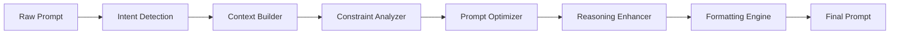

# promptIO : Prompt Intelligent Optemizer 
---
# 🚀 PromptIO
---
### *Prompt Intelligent Optimizer*
---
<p align="center">


</p>

<p align="center">
  
</p>

<h3 align="center">
🧠 Transform Ordinary Prompts into High-Performance AI Instructions
</h3>

---

## 📖 Overview

**PromptIO (Prompt Intelligent Optimizer)** is an advanced AI prompt engineering framework designed to automatically analyze, restructure, and optimize user prompts before sending them to Large Language Models.

Instead of relying on users to become prompt engineers, PromptIO intelligently rewrites prompts using reasoning strategies, context enrichment, instruction decomposition, role assignment, output formatting, and optimization heuristics.

Think of it as a **compiler for prompts**.

---

# ✨ Features

### 🧠 Intelligent Prompt Optimization

- Context Expansion
- Instruction Clarification
- Goal Extraction
- Role Assignment
- Constraint Detection
- Intent Classification
- Few-shot Injection
- Output Format Selection
- Token Optimization
- Prompt Compression

---

### ⚡ AI Techniques

- Chain-of-Thought Prompting
- Tree-of-Thought Prompting
- ReAct
- Self Reflection
- Multi-Step Reasoning
- Prompt Chaining
- Retrieval-Augmented Prompting
- Dynamic Role Prompting
- Constitutional Prompting
- Meta Prompt Engineering

---

### 🎯 Optimization Modes

| Mode | Description |
|-------|-------------|
| ⚡ Fast | Minimal optimization for speed |
| 🧠 Smart | Balanced optimization |
| 🚀 Expert | Advanced reasoning enhancement |
| 🔬 Research | Maximum reasoning quality |
| 💎 Custom | User-defined optimization pipeline |

---

# 🏗 Architecture

```text
                  User Prompt
                       │
                       ▼
              Intent Analyzer
                       │
                       ▼
            Prompt Intelligence Engine
      ┌─────────────────────────────────┐
      │ Context Expansion               │
      │ Constraint Detection            │
      │ Role Assignment                 │
      │ Prompt Structuring              │
      │ Reasoning Injection             │
      │ Format Optimization             │
      └─────────────────────────────────┘
                       │
                       ▼
             Optimized Prompt
                       │
                       ▼
          Any LLM (GPT / Claude / Gemini / DeepSeek)
                       │
                       ▼
                 Better Responses
```

---

# ⚙️ Core Pipeline



---

# 📂 Project Structure

```bash
PromptIO/
│
├── app/
│   ├── api/
│   ├── optimizer/
│   ├── models/
│   ├── prompts/
│   ├── services/
│   ├── utils/
│   └── config/
│
├── assets/
│
├── examples/
│
├── docs/
│
├── tests/
│
├── main.py
│
├── requirements.txt
│
└── README.md
```

---

# 🚀 Installation

```bash
git clone https://github.com/yourusername/promptio.git

cd promptio

python -m venv venv

source venv/bin/activate

pip install -r requirements.txt
```

---

# 🔥 Usage

### Basic Example

```python
from promptio import PromptOptimizer

optimizer = PromptOptimizer()

optimized = optimizer.optimize(
    "Build me a chatbot."
)

print(optimized)
```

---

### Output

```text
Role:
You are a Senior AI Software Architect.

Objective:
Design a scalable chatbot architecture.

Requirements:
- Python
- FastAPI
- LangChain
- Redis
- PostgreSQL

Output:
Provide:
1. System Architecture
2. Folder Structure
3. API Design
4. Deployment Strategy
5. Best Practices

Think step-by-step before answering.
```

---

# 🎯 Supported LLMs

| Model | Supported |
|---------|-----------|
| GPT-4o | ✅ |
| GPT-5 | ✅ |
| Claude | ✅ |
| Gemini | ✅ |
| DeepSeek | ✅ |
| Mistral | ✅ |
| Llama | ✅ |
| Qwen | ✅ |
| Grok | ✅ |

---

# 🧩 Optimization Components

```
Prompt
    │
    ▼
Intent Detection

    ▼
Semantic Understanding

    ▼
Context Expansion

    ▼
Instruction Rewriting

    ▼
Reasoning Enhancement

    ▼
Constraint Injection

    ▼
Output Formatting

    ▼
Final Optimized Prompt
```

---

# 📊 Before vs After

### ❌ Original Prompt

```text
Make me a portfolio website.
```

---

### ✅ PromptIO Output

```text
Role:
You are an award-winning Full Stack Developer and UI/UX Designer.

Task:
Create a modern developer portfolio website.

Requirements:
- Responsive Design
- Dark Mode
- Framer Motion Animations
- React + Tailwind CSS
- SEO Optimization
- Accessibility (WCAG)
- Performance >95 Lighthouse

Deliverables:
- Folder Structure
- Component Architecture
- Source Code
- Deployment Guide
- Future Improvements

Reason carefully before producing the final solution.
```

---

# 📈 Performance Goals

| Metric | Target |
|----------|---------|
| Prompt Quality | 95%+ |
| Response Accuracy | +40% |
| Token Efficiency | +25% |
| Hallucination Reduction | High |
| Prompt Compression | Adaptive |
| Latency | <100ms Optimization |

---

# 🌍 API Example

```http
POST /optimize

{
    "prompt":"Explain quantum computing",
    "mode":"expert",
    "llm":"gpt-5"
}
```

---

Response

```json
{
  "optimized_prompt": "...",
  "intent": "education",
  "mode": "expert",
  "confidence": 0.98
}
```

---

# 🛠 Tech Stack

- Python
- FastAPI
- Pydantic
- OpenAI SDK
- Anthropic SDK
- LangChain
- Redis
- PostgreSQL
- Docker
- Kubernetes
- GitHub Actions

---

# 📚 Roadmap

- [x] Prompt Optimization Engine
- [x] Intent Classification
- [x] Context Expansion
- [x] Prompt Templates
- [ ] Memory Module
- [ ] Multi-Agent Optimization
- [ ] RAG Integration
- [ ] Prompt Benchmarking
- [ ] Prompt Scoring
- [ ] Prompt Versioning
- [ ] VS Code Extension
- [ ] Browser Extension
- [ ] CLI Tool
- [ ] REST API
- [ ] SDK (Python & JavaScript)
- [ ] SaaS Dashboard

---

# 🧪 Benchmark

| Prompt | Original | PromptIO |
|----------|----------|-----------|
| Clarity | ⭐⭐⭐ | ⭐⭐⭐⭐⭐ |
| Structure | ⭐⭐ | ⭐⭐⭐⭐⭐ |
| Context | ⭐ | ⭐⭐⭐⭐⭐ |
| Precision | ⭐⭐ | ⭐⭐⭐⭐⭐ |
| AI Performance | ⭐⭐⭐ | ⭐⭐⭐⭐⭐ |

---

# 🤝 Contributing

Contributions are welcome.

1. Fork the repository
2. Create a feature branch
3. Commit changes
4. Push to GitHub
5. Open a Pull Request

---

# 📜 License

Licensed under the **MIT License**.

---

# ⭐ Why PromptIO?

Most people blame AI when the output is poor. In reality, the prompt is usually the weak link. Humans keep expecting models to read minds, which remains an inconveniently unsupported feature.

PromptIO bridges that gap by turning vague instructions into structured, context-rich prompts that help any modern LLM produce more accurate, consistent, and useful responses.

---

<p align="center">

### **🧠 Prompt Better. Think Smarter. Build Faster.**

**PromptIO • Prompt Intelligent Optimizer**

Made with ❤️ for AI Engineers, Researchers, Developers & Builders.

</p>
